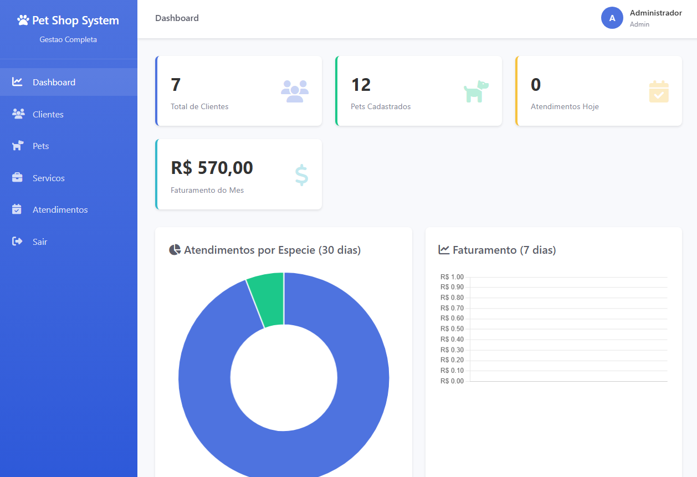
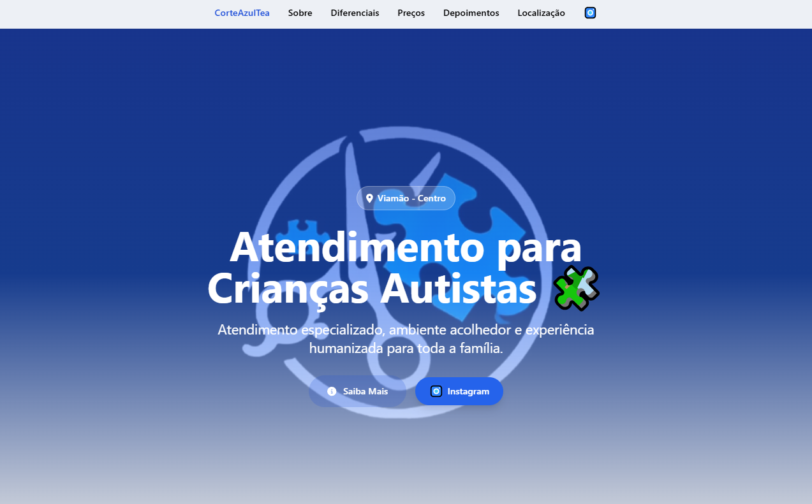

# Natan Da Luz Cândido

## Desenvolvedor Backend - PHP | Laravel | JavaScript | REST APIs | MySQL

  
  
  

---

## Sobre mim

Olá, eu sou o Natan, Desenvolvedor Backend com foco em PHP, Laravel, JavaScript, APIs REST e MySQL. Gosto de desenvolver sistemas orientados a regras de negócio e valorizo código organizado, seguro, escalável e fácil de manter. Tenho interesse especial em arquitetura de software, modelagem de dados, validação, autorização, segurança e boas práticas de desenvolvimento backend. Busco aprimorar continuamente meus conhecimentos para construir soluções consistentes e preparadas para crescer de forma sustentável.

Atualmente busco minha primeira oportunidade como Desenvolvedor Backend, construindo projetos reais para evoluir continuamente minhas habilidades técnicas.

---

## Minha Stack

<table>
  <tr>
    <td valign="top" width="50%">
      <h3>Backend</h3>
      

        
        
        
      

    </td>
    <td valign="top" width="50%">
      <h3>Banco de dados</h3>
      

        
        
        
      

    </td>
  </tr>
  <tr>
    <td valign="top" width="50%">
      <h3>Frontend</h3>
      

        
        
        
        
        
      

    </td>
    <td valign="top" width="50%">
      <h3>Ferramentas</h3>
      

        
        
        
        
      

    </td>
  </tr>
</table>

### Conhecimentos

  
  
  
  
  
  
  
  
  

---

## Projetos em destaque

<table>
  <tr>
    <td>
      
    </td>
  </tr>
  <tr>
    <td>
      <h3>MeuSaldoCerto</h3>
      
Sistema financeiro desenvolvido com Laravel, focado em controle de receitas, despesas, categorias, relatórios e visualização de dados em dashboard.

      
<strong>Funcionalidades:</strong> login, registro, dashboard, receitas, despesas, categorias, relatórios, gráficos, policies, form requests, paginação e autorização.

      
<strong>Tecnologias:</strong> Laravel, PHP, MySQL, Blade, Chart.js.

      
    </td>
  </tr>
</table>

<table>
  <tr>
    <td>
      
    </td>
  </tr>
  <tr>
    <td>
      <h3>PetSystem</h3>
      
Sistema completo para petshops e clínicas veterinárias, com foco em gestão de clientes, pets, serviços, agendamentos e histórico operacional.

      
<strong>Funcionalidades:</strong> login, dashboard, clientes, pets, serviços, agendamentos, usuários, CRUD, controle de sessão, segurança e histórico.

      
<strong>Tecnologias:</strong> PHP, MySQL, JavaScript, Chart.js.

    </td>
  </tr>
</table>

<table>
  <tr>
    <td>
      
    </td>
  </tr>
  <tr>
    <td>
      <h3>Corte Azul T.E.A</h3>
      
Website institucional desenvolvido para cliente, com foco em apresentação profissional, navegação objetiva e presença digital responsiva.

      
<strong>Funcionalidades:</strong> página institucional, estrutura responsiva, organização de conteúdo e interface orientada à comunicação do cliente.

      
<strong>Tecnologias:</strong> HTML, CSS, JavaScript.

      
    </td>
  </tr>
</table>

---

## Atualmente Estudando

  
  
  
  
  
  
  
  

---

## Contato

---

  Obrigado pela visita. Meu foco é construir software backend com clareza, segurança e responsabilidade técnica.

