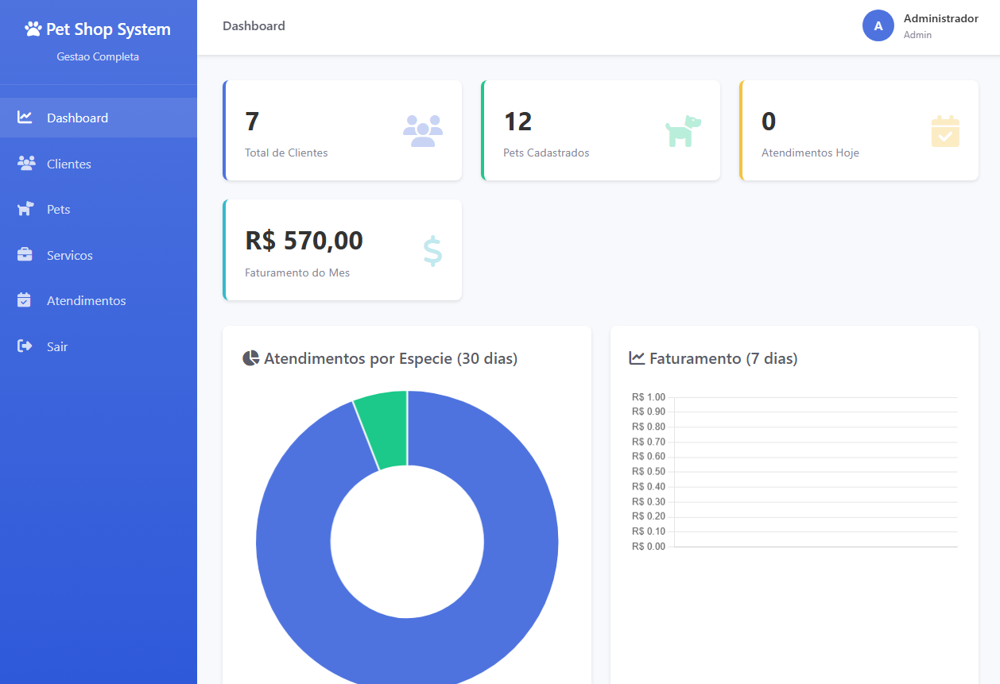
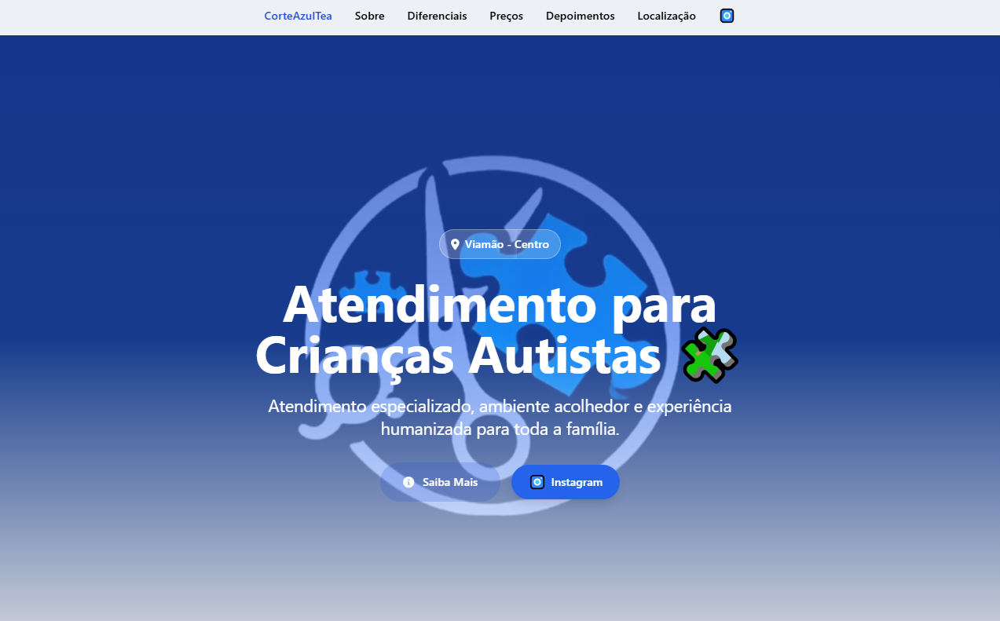

# Natan Da Luz

**Desenvolvedor de Software** · PHP | Laravel | JavaScript | MySQL | PostgreSQL | Docker

---

## Sobre mim

Desenvolvedor de Software com foco em backend, atuando na construção de sistemas web e APIs. Tenho interesse especial em arquitetura de software, modelagem de dados, validação, autorização e segurança, sempre priorizando código organizado, escalável e fácil de manter. Também possuo conhecimento complementar em Frontend, aplicado quando o projeto exige integração completa entre as camadas. Busco evoluir continuamente minhas práticas de desenvolvimento para construir soluções consistentes e preparadas para crescer de forma sustentável.

---

## Tecnologias

### Backend
Base do meu trabalho: construção de APIs REST e regras de negócio com PHP e Laravel.

### Banco de Dados
Modelagem, relacionamentos e consultas com foco em performance e integridade dos dados.

### Frontend
Conhecimento complementar, usado para integrar e finalizar as interfaces dos sistemas.

### Ferramentas
Versionamento, ambiente de desenvolvimento e sistema operacional utilizados no dia a dia.

---

## Projetos

### MeuSaldoCerto

Sistema financeiro desenvolvido com Laravel, focado em controle de receitas, despesas, categorias, relatórios e visualização de dados em dashboard.

**Principais funcionalidades**
- Login e registro de usuários
- Dashboard com indicadores
- Cadastro de receitas, despesas e categorias
- Relatórios e gráficos
- Policies, form requests, paginação e autorização

**Tecnologias**

[**Demo**](https://meu-saldo-certo-production.up.railway.app/)

---

### PetSystem

Sistema completo para petshops e clínicas veterinárias, com foco em gestão de clientes, pets, serviços, agendamentos e histórico operacional.

**Principais funcionalidades**
- Login e dashboard
- Cadastro de clientes e pets
- Gestão de serviços e agendamentos
- Controle de usuários e sessões
- CRUD completo com histórico e segurança

**Tecnologias**

---

### Corte Azul T.E.A

Website institucional desenvolvido para cliente, com foco em apresentação profissional, navegação objetiva e presença digital responsiva.

**Principais funcionalidades**
- Página institucional
- Estrutura responsiva
- Organização de conteúdo
- Interface orientada à comunicação com o cliente

**Tecnologias**

[**Visitar site**](https://projeto-corte-azul-tea.vercel.app/)

---

## Estatísticas do GitHub

---

## Contato

---

  Obrigado pela visita. Meu foco é construir software com clareza, segurança e responsabilidade técnica.

